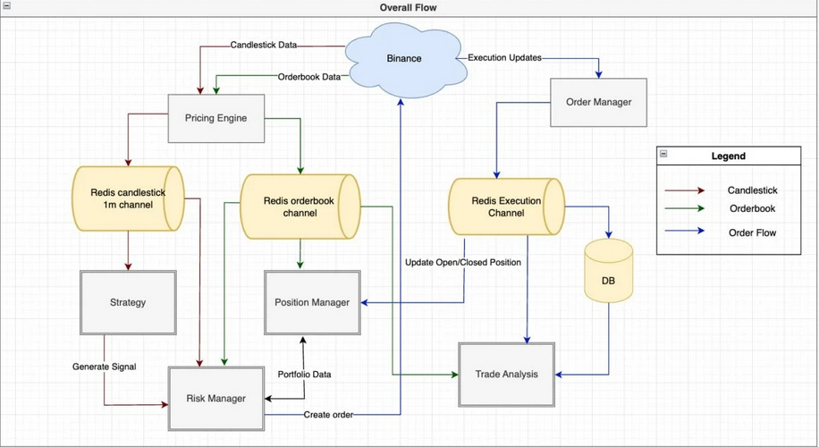
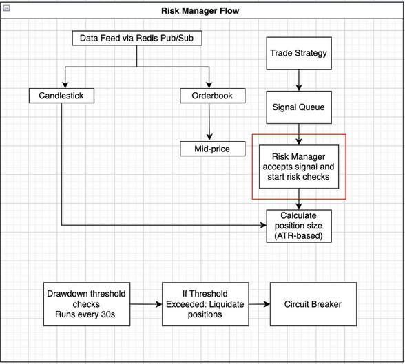
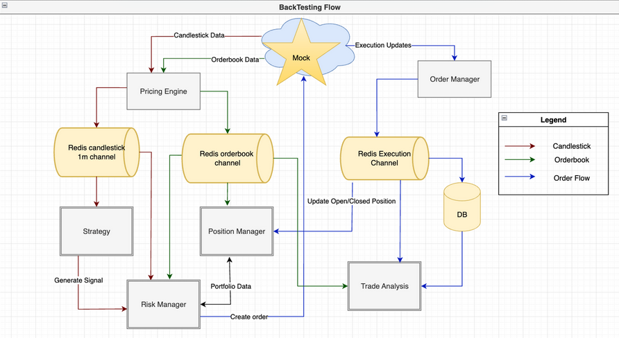

# QF635 - Market Microstructure Trading Bot 🤖

This repository is part of the coursework for **QF635 - Market Microstructure**.

We build an automated **trading bot** that operates based on MACD signals, using real-time data and modular system components.

---

## 📦 Requirements

To run this project, you'll need to have [Docker](https://docs.docker.com/get-docker/) installed.

It uses the following components (started via docker) :

1. Redis
2. PostgresSQL (database)
3. Main program

---

## ▶️ How to Run

Create a `.env` file using `.env.example` as template.

Start the trading bot with:

```bash
docker-compose up trading-bot
```

To shut down the services:

```bash
docker-compose down
```

---

## 📈 Strategy Overview: MACD-Based Trading

We use the **MACD (Moving Average Convergence Divergence)** indicator to decide when to buy or sell based on momentum shifts.

### Initialization

- The bot fetches the last 200 1-minute candles.
- Calculates:
  - Fast EMA (e.g., 12-period)
  - Slow EMA (e.g., 26-period)
  - MACD line: `EMA_FAST - EMA_SLOW`
  - Signal line: EMA of MACD (e.g., 9-period)
- These indicators are stored in a DataFrame.

### Update Loop

- Each closed 1-minute candle is used to:
  - Recalculate Fast EMA, Slow EMA, MACD
  - Update Signal Line incrementally
- If MACD crosses above Signal Line → **Buy Signal**
- If MACD crosses below Signal Line → **Sell Signal**

---

## 🧩 System Architecture

We have the following components : 
- Binance API/Data Gateway
- Portfolio Manager
- Risk Manager
- Order Management System

Diagram :


## Risk Management

For our risk management, we go with the following approaches :

- Continously assess maximum downside risk of the portfolio every 30s
- Monitor trailing down, and triggers emergency liquidation when drawdown is breached

Diagram: 


# Backtesting 

We implement event-driven backtesting which mimics market replay (using historical Kline-Events)

Diagram: 


---

## 📚 Notes

- Uses Binance testnet for data access (via API gateway).
- Logs events such as signal generation, data updates, and strategy state.
- All computation is handled using `pandas`.

---

## 🔒 Disclaimer

This project is for academic purposes only. Not intended for actual trading or financial use.
